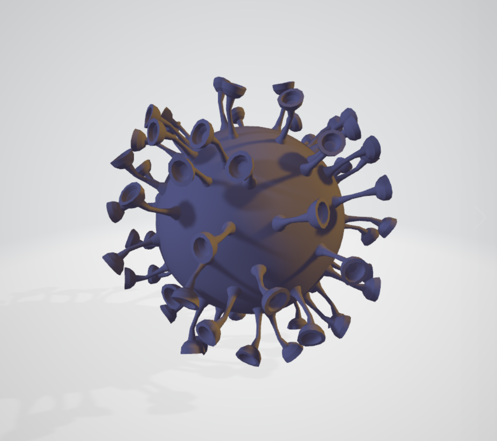
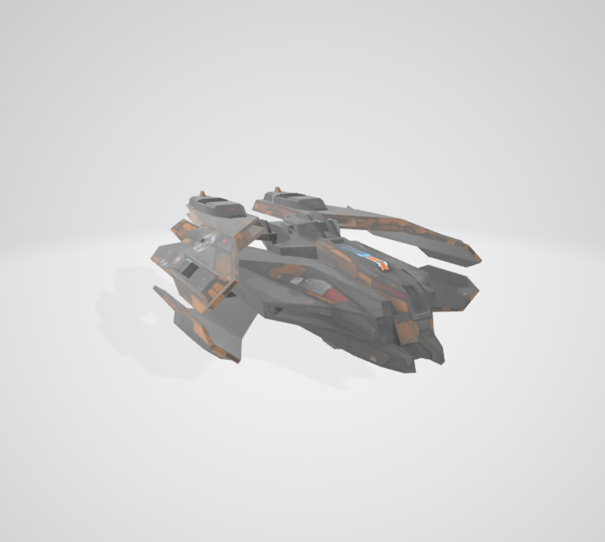

# Introduction: Fire at Coronavirus
This is a computer graphics project created for CSE 167 offered at UCSD. For basic functions and features, check following blogs.

# Blog March 9th
Our project name, member and key features remain the same: Our project is a game called "Fire at Coronavirus". As SARS-COV-2 virus is spreading globally, we need to recruit someone who can help fight the virus. The player will control a nanometer-level fighter to eliminate the virus in the air. Player as pilot needs to control the craft to avoid the virus and fire nano-bullets to destroy them.\
Here are some updates
1. In the previous six days we completed the implementation of first-person view control, whereby thge player can controls the aircraft itself and the view of the aircraft by left mouse button and right mouse button respectively. 
2. We also started on procedurally generating animated clouds. Currently we are able to generate the cloud and incorporate the cloud with the original skybox background. The next step for this technical feature would be making the generated cloud animated. 
3. For the third technical features we successfully enabled the functionality to launch bullets from the aircraft. Afterwards we will enable collision detection of the bullet with arbitrary geometry and generate visual effects if that occurs.

The following screenshot shows the effect of the procedually generated cloud: 

# Blog March 3rd
Today we will introduce some basic ideas and features that will be involved in this project. \
Our project is a game called "Fire at Coronavirus". As SARS-COV-2 virus is spreading globally, we need to recruit someone who can help fight the virus. The player will control a nanometer-level fighter to eliminate the virus in the air. Player as pilot needs to control the craft to avoid the virus and fire nano-bullets to destroy them.\
We currently plan to implement the following features:
1. First-Person view control, whereby the player controls the aircraft.
2. Procedurally generated and animated clouds. These clouds are tiny water drops in the air where virus hide.
3. Collision Detection with arbitrary geometry. We will use this to determine if the fired bullet hits the virus or if the nano-fighter hits on an obstacle or an virus.

We will be creative on simulating the nano-aircraft flight and the coronavirus. Real-looking and fancy textures will be worth looking into. Also there could be other objects flowing in the air that may educates people about the micro-scope world.

The following two images are basic models that we will use (the fighter and the virus).

Finally, credit to our two contributors: Cheng Shen and Manxue Li
